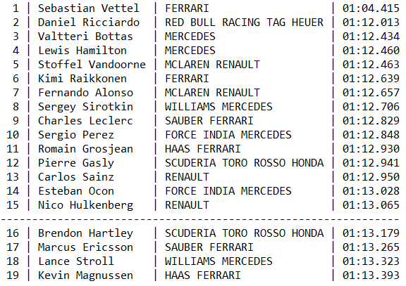

# Q1Top15

## Description

- This is Java Formula 1 application, the first stage of the qualification. It prints report that shows the top 15 racers, which go to the Q2 stage and the rest ones after the underline.

>_Must be 3 files in '/javastreamsapi/src/main/resources': 'abbreviations.txt', 'end.log' and 'start.log'._

>_You can edit files to another data Q1, but format of data must be the same as in example._

## Example:

There are 1 text file 'abbreviations.txt' that contains abbreviation explanations and 2 log files ‘start.log’ and ‘end.log’ that contain start and end data of the best lap for each racer of Formula 1 - Monaco 2018 Racing. (Start and end times are fictional, but the best lap times are true). Data contains only the first 20 minutes that refers to the first stage of the qualification.
- [abbreviations.txt](src/main/resources/abbreviations.txt)
- [start.log](src/main/resources/abbreviations.txt)
- [end.log](src/main/resources/abbreviations.txt)

Example of report according to those files will be:

- 

## Usage

- In the root folder of this project enter command to build project:

> mvn clean package spring-boot:repackage

- To execute in the root folder of this project enter command:

> java -jar target/Q1Top15.jar
